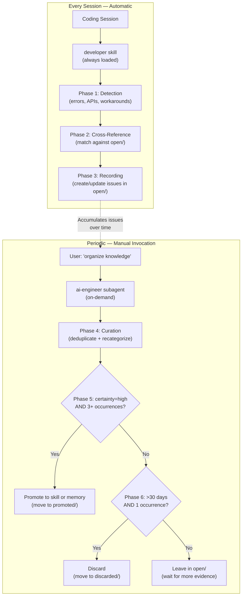

# prompt-forge Knowledge Strategy

> **Date:** 2026-08-01
> **Purpose:** Document and validate the issue-registration-to-skill-promotion pipeline against industry practices

---

## The Two-Tier Learning Loop

prompt-forge splits knowledge management into two roles with different triggers and privileges:



### Why Two Tiers?

| Concern | One-Tier (monolithic) | Two-Tier (prompt-forge) |
|---------|----------------------|------------------------|
| Safety | Promotion runs automatically — risk of polluting skills with noise | Promotion is always a conscious decision |
| Token cost | Full pipeline runs every session | Recording only (cheap); curation on demand |
| Context window | Single agent must hold all phases | ai-engineer runs as subagent with dedicated context |
| Audit trail | Hard to trace who promoted what | `reviewed_by` field tracks every action |
| Rollback | Destructive actions mixed with recording | Recording is always safe; only ai-engineer mutates |

---

## Comparison with Industry Approaches

### Claude Code — Auto Memory

Claude Code's auto memory is the closest analogue to prompt-forge's developer skill. Claude **automatically** saves notes to `~/.claude/projects/<project>/memory/MEMORY.md` when it detects something worth remembering.

| Aspect | Claude Code Auto Memory | prompt-forge |
|--------|------------------------|-------------|
| **Trigger** | Claude decides autonomously | `developer` runs at session end |
| **Storage** | `MEMORY.md` + topic files in home dir | `knowledge/issues/open/ISSUE-*.md` in repo |
| **Structure** | Freeform markdown | YAML frontmatter + structured fields |
| **Promotion** | None — all entries stay in MEMORY.md | Formal promotion pipeline via ai-engineer |
| **Sharing** | Machine-local only | Git-versioned, team-shared |
| **Deduplication** | Claude handles internally | ai-engineer Phase 1 (keyword overlap) |
| **Cleanup** | None — MEMORY.md grows indefinitely | ai-engineer Phase 6 (>30 days, single occurrence → discard) |

**Key insight:** Claude Code's auto memory is purely note-taking. prompt-forge adds a **formal curation layer** that Claude Code lacks. The issue registry is team-shared via Git; Claude's auto memory is per-machine.

### Cursor — Rules for AI

Cursor uses `.cursor/rules/` files — markdown instructions scoped by glob patterns. These are **manually written**, not auto-generated.

| Aspect | Cursor Rules | prompt-forge |
|--------|-------------|-------------|
| **Author** | Human | AI agent (developer) + human review (ai-engineer) |
| **Trigger** | File path match | Session-end scan |
| **Promotion** | N/A (manual creation) | Automated via ai-engineer |
| **Learning** | None — static rules | Accumulates across sessions |

**Key insight:** Cursor rules = CLAUDE.md. prompt-forge's skills are the same idea, but prompt-forge **generates** them from detected patterns rather than requiring humans to anticipate everything.

### GitHub Copilot — `.github/copilot-instructions.md` + `.instructions.md`

Copilot's instruction system is purely declarative — humans write instructions, Copilot reads them. No learning loop exists.

**Key insight:** prompt-forge fills a gap that no major AI coding platform addresses: **automated pattern detection and promotion.** Every other tool requires humans to manually encode knowledge. prompt-forge detects it automatically and promotes it with human approval.

---

## The Three-Occurrence Threshold: Why 3?

The promotion threshold of 3 occurrences is grounded in:

1. **Statistical reasoning:** One is an anecdote, two is a coincidence, three is a pattern. This heuristic is used across scientific and engineering disciplines.

2. **Signal-to-noise ratio:** Promoting on first occurrence would flood the skill system with noise. Most one-off errors are not worth encoding permanently. The 30-day auto-discard for single-occurrence issues keeps the registry clean.

3. **Cross-session validation:** Occurrences must span different sessions. Two occurrences in the same session could be the same bug manifesting twice. Three occurrences across different days/contexts confirms a genuine pattern.

4. **Token economics:** Each promoted skill or memory entry costs tokens in every future session (via progressive disclosure). Premature promotion wastes tokens permanently.

### Certainty Tiers

| Certainty | Occurrences | Meaning | Action |
|-----------|------------|---------|--------|
| `low` | 1 | Possible pattern, unconfirmed | Keep in `open/` |
| `medium` | 2 | Emerging pattern | Flag for review |
| `high` | 3+ | Confirmed pattern | Eligible for promotion |

---

## Category-Based Promotion Routing

prompt-forge routes promoted knowledge to different destinations based on its **category**. This prevents a monolithic knowledge base and enables progressive disclosure.

| Category | Example | Promotion Target | Rationale |
|----------|---------|-----------------|-----------|
| `library-api` | "ngx-translate v18 dropped `forRoot()`" | `/memories/<lib>-api.md` | User memory loads into every session automatically |
| `powershell` | "PowerShell interprets `{{ }}` in heredocs" | `powershell-patterns/SKILL.md` | Extends existing skill; loaded on trigger only |
| `angular` | "Standalone components must import pipes" | `/memories/angular-pitfalls.md` | Framework-specific, loaded every session |
| `git` | "Squash-based workflow for feature branches" | `git-workflow/SKILL.md` | Extends existing skill |
| `skill-creation` | "Docker patterns recurring across projects" | New `.github/skills/docker/SKILL.md` | New domain → new skill |
| `project-specific` | "Monorepo uses npm workspaces" | `/memories/repo/` | Scoped to current repository |
| `unknown` | Unclear pattern | Stay in `open/` | Needs human triage |

### Why This Matters

- **Progressive disclosure preserved:** A PowerShell pitfall only loads when the agent runs terminal commands. A library API note loads every session because it could affect any task.
- **No monolith:** Skills stay focused. `powershell-patterns` doesn't bloat with Angular content.
- **Auditable:** The routing table in `INDEX.md` is the single source of truth. Anyone can see where knowledge ends up.

---

## The Issue Lifecycle

```
                    ┌──────────────┐
                    │   Detected   │
                    │  (developer) │
                    └──────┬───────┘
                           │
                           ▼
                    ┌──────────────┐
                    │  open/       │  certainty: low (1 occurrence)
                    │  ISSUE-*.md  │
                    └──────┬───────┘
                           │
              ┌────────────┼────────────┐
              │            │            │
              ▼            ▼            ▼
        2nd occurrence  3rd occurrence  >30 days, 1 occurrence
              │            │            │
              ▼            ▼            ▼
        certainty:    certainty:    ┌──────────────┐
        medium        high          │ discarded/   │
              │            │        │ "stale"      │
              │            │        └──────────────┘
              │            │
              │            ▼
              │     ┌──────────────┐
              │     │ ai-engineer  │
              │     │ promotion    │
              │     └──────┬───────┘
              │            │
              │     ┌──────┴───────┐
              │     │              │
              │     ▼              ▼
              │  ┌──────────┐  ┌──────────┐
              │  │ Skill    │  │ Memory   │
              │  │ .github/ │  │ /memories│
              │  │ skills/  │  │          │
              │  └──────────┘  └──────────┘
              │
              └──► waits for 3rd occurrence
```

---

## Strengths of This Approach

1. **Team-shared knowledge.** Unlike Claude Code's machine-local auto memory, prompt-forge's issue registry is Git-versioned. The entire team benefits from each developer's discoveries.

2. **Human-in-the-loop promotion.** ai-engineer asks for confirmation before promoting to a skill. This prevents AI hallucinations from becoming permanent instructions.

3. **Self-cleaning.** Stale single-occurrence issues auto-discard after 30 days. The registry doesn't accumulate cruft.

4. **Zero-infrastructure.** Filesystem + Git. No database, no API, no credentials. Works in air-gapped environments.

5. **Agent-agnostic.** The issue format is plain Markdown with YAML frontmatter. Any AI coding platform can read it.

---

## Limitations & Risks

1. **Heuristic deduplication.** Two issues describing the same underlying problem with different wording could theoretically be created as separate files. This is mitigated at two levels: the `developer` skill cross-references new signals against existing issues via keyword overlap (Phase 2) and updates matches instead of creating duplicates; if any slip through, the `ai-engineer` subagent's deduplication phase (Phase 1) merges them during periodic curation.

2. **Cold start problem.** A new project has no issues, so the first few occurrences of a pattern cost tokens without immediate benefit. The explore-codebase skill mitigates this by teaching efficient search from session one.

3. **Promotion requires manual invocation.** If the user never runs ai-engineer, issues accumulate in `open/` indefinitely. The auto-discard (30 days) prevents unbounded growth, but confirmed patterns won't be promoted without human action. This is intentional — promotion is a conscious decision — but it means the system needs a human curator.

---

## Comparison Summary

| Feature | prompt-forge | Claude Code | Cursor | GitHub Copilot |
|---------|-------------|-------------|--------|---------------|
| Auto-detection of patterns | ✅ developer | ✅ auto memory | ❌ | ❌ |
| Formal promotion pipeline | ✅ ai-engineer | ❌ | ❌ | ❌ |
| Team-shared knowledge | ✅ Git | ❌ local only | ✅ Git (manual) | ✅ Git (manual) |
| Structured issue format | ✅ YAML frontmatter | ❌ freeform | N/A | N/A |
| Certainty tiers | ✅ low/medium/high | ❌ | N/A | N/A |
| Auto-cleanup of stale entries | ✅ 30-day discard | ❌ | N/A | N/A |
| Progressive disclosure | ✅ skills + memories | ✅ skills | ✅ rules | ✅ instructions |
| Human approval for promotion | ✅ askQuestions | N/A | N/A | N/A |
| Agent-agnostic | ✅ | ❌ Claude only | ❌ Cursor only | ❌ Copilot only |

---

## Recommendations

1. **Consider a reminder mechanism** — after N issues accumulate in `open/`, the developer skill could suggest running ai-engineer. Currently the user must remember.

2. **Monitor the 3-occurrence threshold** — if promotion seems too slow or too aggressive for your team's velocity, adjust. The threshold is configurable in INDEX.md's decision criteria.
